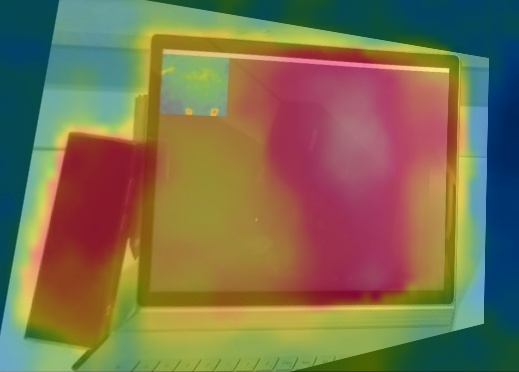
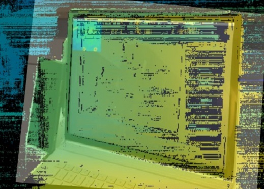
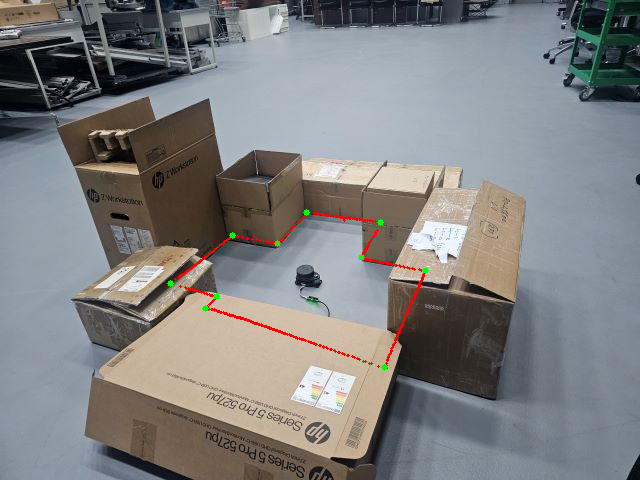

# Homography Tutorial

This repository contains **interactive tutorials** demonstrating how to compute and visualize **planar homographies** between different sensing modalities:

- **Camera ↔ Camera:** Align an RGB image with a thermal (or other) camera image.  
- **LiDAR ↔ Camera:** Project 2D RPLIDAR scans onto a camera image of the same scene.

Both tutorials include Jupyter notebooks and standalone Python scripts for quick experimentation.

---

## Camera ↔ Camera Alignment

Planar homography can align views from different cameras observing the same surface.  
Below are examples showing alignment between an **RGB camera** and a **Thermal camera** (left), and between an **RGB camera** and a **Depth camera** (right).  


<p align="center">
  
  
</p>

<p align="center">
  <em>Figure 1 - Left: RGB-Thermal alignment using planar homography.  
  Right: RGB-Depth alignment showing geometric consistency across modalities.</em>
</p>

---

## LiDAR ↔ Camera Alignment

In this case, a 2D LiDAR scan is aligned with a camera image of the same scene using point correspondences lying on a shared plane.  
The homography maps LiDAR points from the metric plane into the camera's image plane, producing an overlay that reveals spatial consistency between range and visual data.

<p align="center">
  
</p>

<p align="center">
  <em>Figure 2 - LiDAR-Camera homography calibration showing projected LiDAR points (red) and planar correspondences (green).</em>
</p>

---

## Repository Structure

```
homography_tutorial/
├─ .gitignore
├─ homography_rgb_resized.jpg      # Example RGB image
├─ homography_thermal.png          # Example thermal/reference image
├─ lidar_all_on_image.png          # Example LiDAR→image overlay result
├─ lidar_camera.jpg                # Example camera photo (optional)
├─ requirements.txt                # Dependencies list
├─ tutorial-cc.ipynb               # Camera↔Camera tutorial (notebook)
└─ tutorial-cl.ipynb               # Camera↔LiDAR tutorial (notebook)
```

---

## Install Dependencies

```bash
pip install -r requirements.txt
```
---

## Tutorial Overview

### 1️⃣ Camera ↔ Camera (`tutorial-cc`)
- Select matching feature points interactively between two images.  
- Compute the **homography matrix** using RANSAC.  
- Warp the source image into the destination frame.  
- Visualize results with a **2×2 grid**:
  - Destination (reference)
  - Warped source
  - Alpha overlay
  - Swipe overlay (left-right split view)

### 2️⃣ LiDAR ↔ Camera (`tutorial-cl`)
- Acquire one or more **full 360° LiDAR scans** robustly (complete revolutions).  
- Pick LiDAR points on a metric grid (OpenCV window).  
- Pick corresponding image pixels.  
- Compute the **LiDAR-plane → image** homography.  
- Project **all LiDAR points** into the image for a combined visualization.

---

## Interactive Controls

| Action | Camera Picker | LiDAR Picker |
|:--------|:------------------|:------------------|
| **Left click** | Add point | Add nearest LiDAR point |
| **Right click** | Remove nearest | Remove nearest |
| **u** | Undo last point | Undo last point |
| **c** | Clear all | Clear all |
| **s** | Save points to CSV | Save points to CSV |
| **q / ESC** | Quit window | Quit window |
---

##  Running the Tutorials

### ▶️ Camera ↔ Camera

Open:
```bash
jupyter lab tutorial-cc.ipynb
```
Follow each cell to:
1. Click corresponding points between both images.  
2. Compute the homography.  
3. Visualize results inline in a 2×2 grid.
4. Interactively select points, and the script will save:
    - `warped_A_to_B.jpg`
    - `overlay_alpha.jpg`
    - `overlay_swipe.jpg`

---

### ▶️ LiDAR ↔ Camera

#### Notebook
```bash
jupyter lab tutorial-cl.ipynb
```
Steps:
1. Acquire a full LiDAR revolution.  
2. Select corresponding LiDAR and image points.  
3. Compute homography and visualize projection.

#### Script
```bash
python tutorial-cl.py
```
Outputs:
- `lidar_points.csv`
- `image_points.csv`
- `lidar_all_on_image.png`

---

## Tips

- Use **8-12 well-spread correspondences** for stable results.  
- Ensure all selected points lie on the **same plane** (e.g., ground or calibration board).  
- Undistort images if using wide-angle lenses before computing the homography.  
- For RPLIDAR:
  - Use the version that detects `new_scan` to ensure complete 360° coverage.
  - Adjust `PORT` (e.g., `COM12`) according to your system.

---

## Troubleshooting

| Issue | Fix |
|:------|:----|
| LiDAR not detected | Check USB cable, use `mode` or `wmic path Win32_SerialPort get DeviceID,Name` |
| COM port not showing up for LiDAR | Install the official Silicon Labs CP210x USB-to-UART drivers from [here](https://www.silabs.com/software-and-tools/usb-to-uart-bridge-vcp-drivers) |
| Scale issues | The LiDAR picker auto-scales grid and range |
| Wrong overlay | Ensure all points are coplanar and ordered correctly |

---

## When to Use a Homography

A homography represents a 2D projective transform, valid only when all points lie on (or approximately on) the **same physical plane**.  
For 3D scenes, use full **extrinsic calibration** (rotation + translation) instead.

---

## License

**MIT License:** You are free to reuse, modify, and distribute.

---

## Citation

If you use this tutorial in your paper or teaching material:

```
@article{shuaibu2025sfsurvey,
  title={TBD},
  author={TBD},
  journal={TBD},
  year={2025},
  note={Submitted}
}
```
